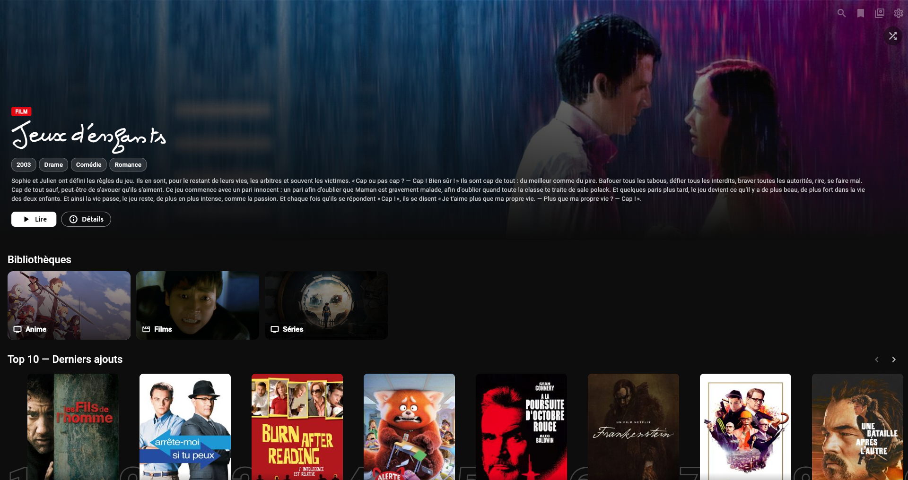
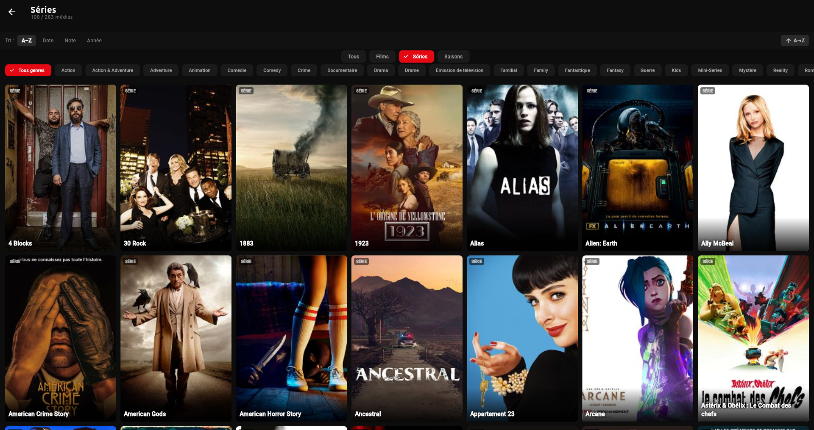
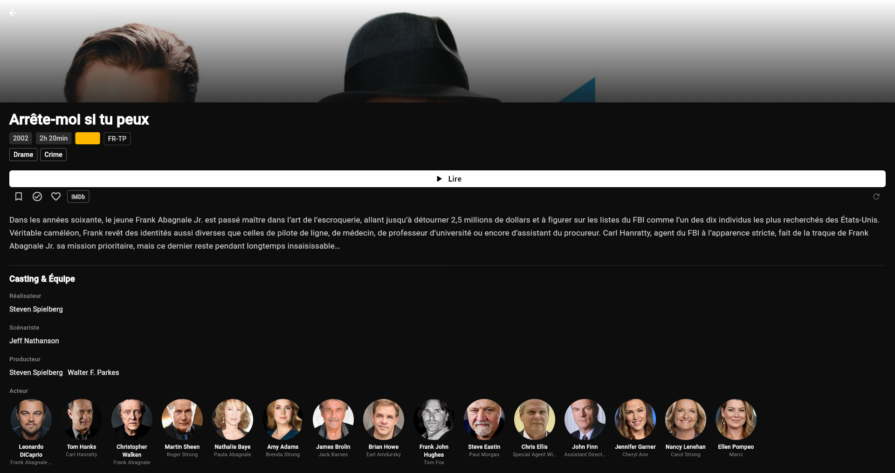
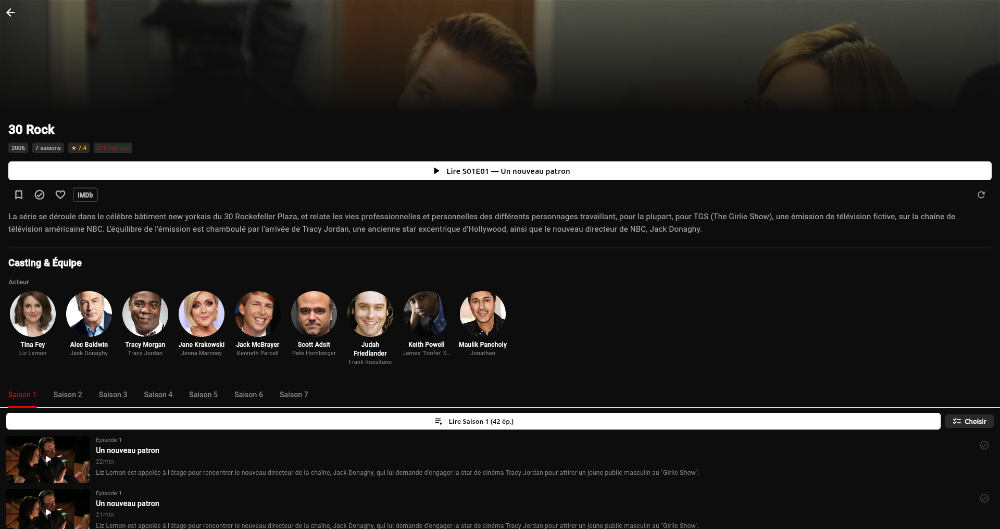
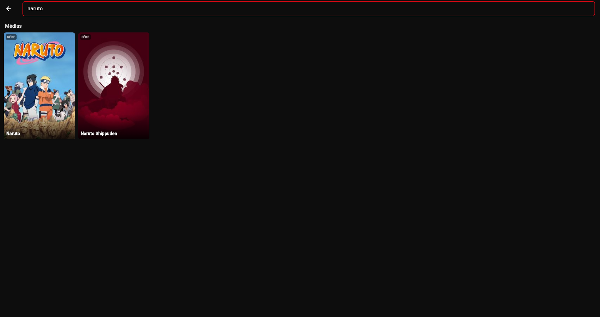
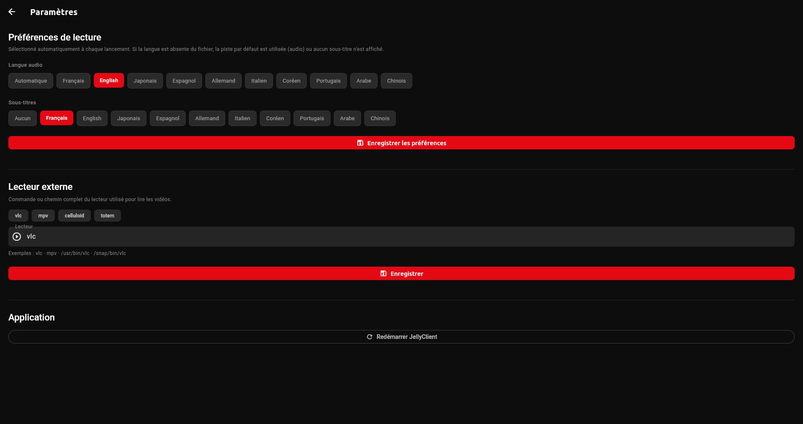

# JellyClient

Client [Jellyfin](https://jellyfin.org) from scratch en Flutter — design dark cinéma inspiré de Netflix.

**Plateformes** : Linux · Windows · iOS (en cours)

## Screenshots

| Dashboard | Bibliothèque |
|---|---|
|  |  |

| Fiche film | Fiche série |
|---|---|
|  |  |

| Recherche | Paramètres |
|---|---|
|  |  |

## Fonctionnalités

- **Dashboard** : Hero banner, Top 10, sections par genre, continuer à regarder
- **Lecture externe** : VLC / mpv / Celluloid avec sélection de piste audio et sous-titres
- **Rapport de progression** : position sauvegardée automatiquement à la fermeture du lecteur
- **Skip intro** : intégration plugin IntroSkipper (si installé sur le serveur)
- **Recherche** : films, séries, acteurs/réalisateurs
- **Multi-serveurs** : gestion de plusieurs instances Jellyfin, test de connexion avec mesure de débit
- **Multi-profils** : switch de compte sans re-saisir les identifiants
- **Badge audio** : affichage MULTI / FR / EN / JA… sur chaque vignette
- **Sessions actives** : voir qui regarde quoi en temps réel
- **Taille des vignettes** : 3 tailles ajustables (petites / moyennes / grandes)
- **Liste de lecture** : watchlist locale

## Prérequis

- [Flutter](https://flutter.dev) 3.41.9+
- Un lecteur externe installé : [VLC](https://videolan.org) (recommandé), mpv, Celluloid…
- Un serveur Jellyfin accessible

## Installation (Linux)

```bash
git clone https://github.com/<votre-utilisateur>/jellyclient.git
cd jellyclient
flutter pub get
dart run build_runner build --delete-conflicting-outputs
flutter build linux --release
```

Le binaire se trouve dans `build/linux/x64/release/bundle/jellyclient`.

## Installation (Windows)

Voir [`portage/windows/BUILD.md`](portage/windows/BUILD.md) pour la procédure complète avec VLC portable.

## Stack technique

| Couche | Lib |
|---|---|
| UI | Flutter 3.41.9 |
| État | Riverpod 2.6 + flutter_hooks |
| Navigation | go_router 14 |
| HTTP | Dio 5.9 |
| Stockage sécurisé | flutter_secure_storage |
| Modèles | Freezed + json_serializable |

## Architecture

```
lib/
├── core/
│   ├── api/           # Client HTTP Jellyfin + modèles Freezed
│   ├── providers/     # Providers Riverpod globaux
│   ├── services/      # Lecteur externe, utilitaires plateforme
│   └── storage/       # Persistance (serveurs, watchlist, préférences)
├── features/          # Écrans (home, detail, series, search, settings…)
└── shared/widgets/    # MediaCard, CastSection…
```

## Configuration

Aucune configuration préalable. Au premier lancement :
1. Ajouter un serveur Jellyfin (URL + identifiants)
2. Sélectionner un profil
3. Configurer le lecteur externe dans Paramètres

## Licence

[MIT](LICENSE)
