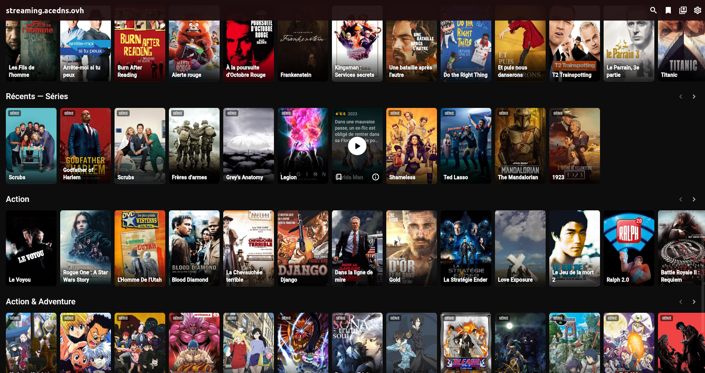
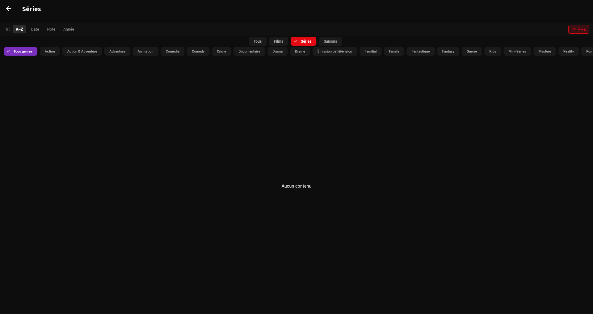
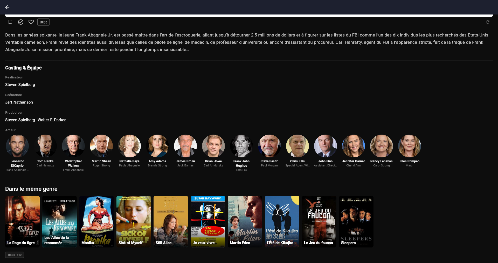
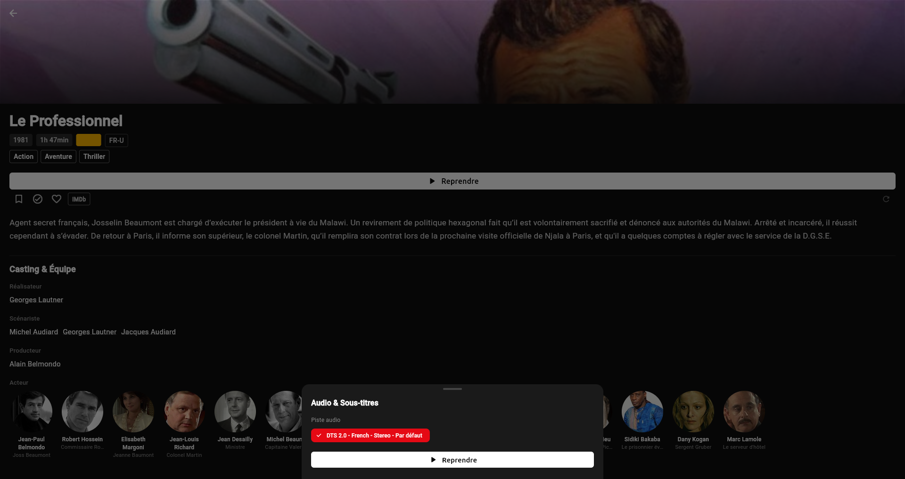
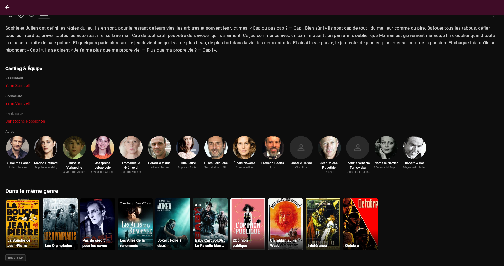
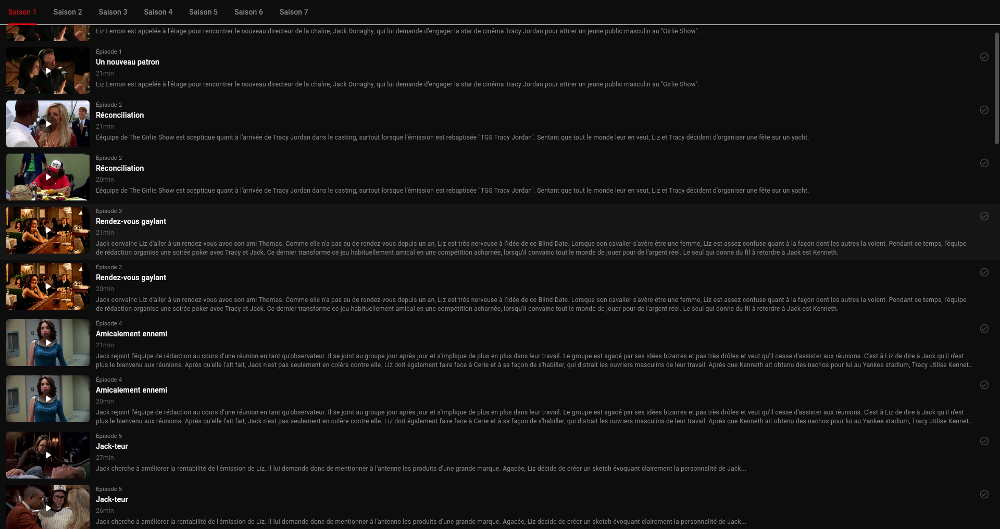
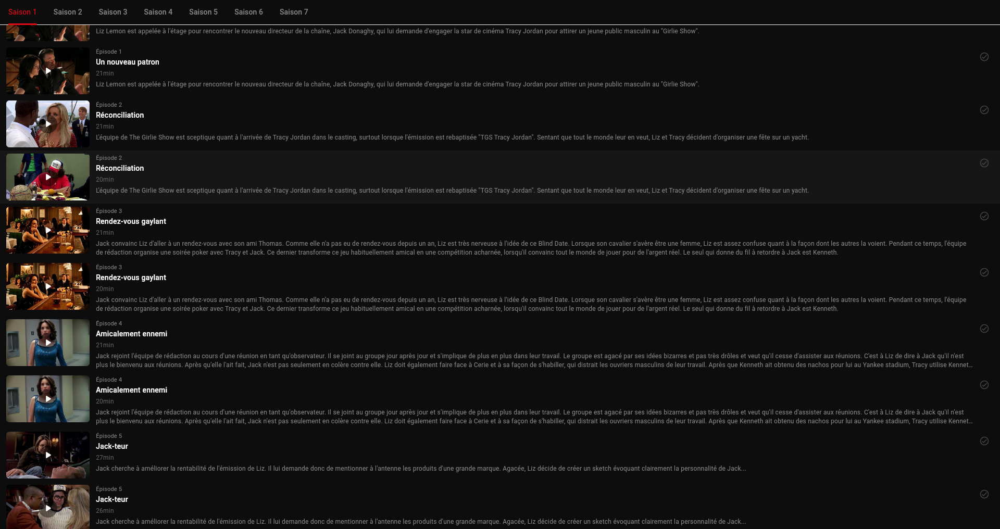
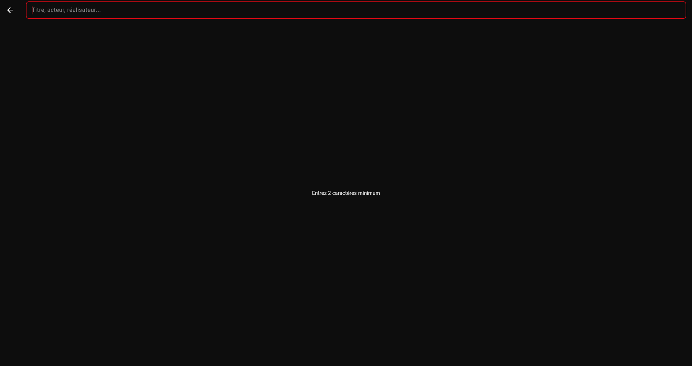
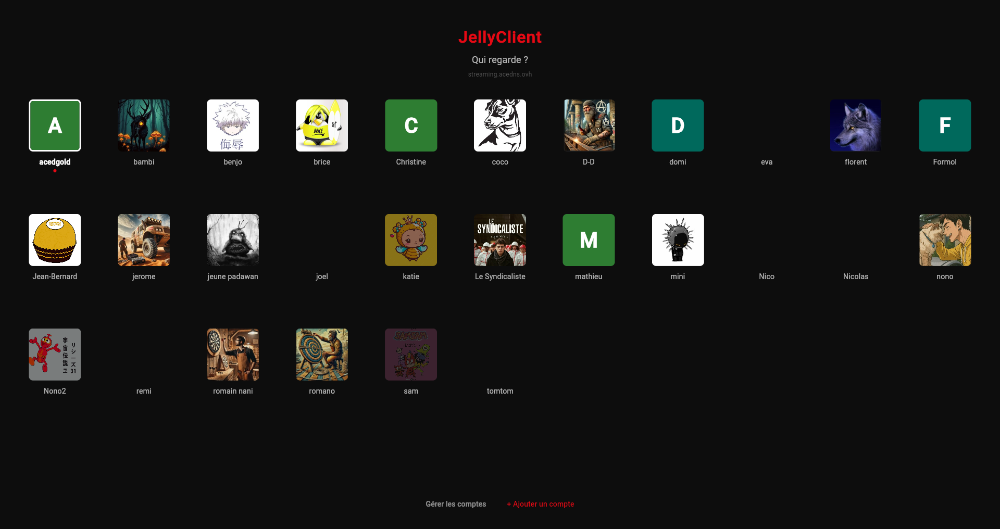
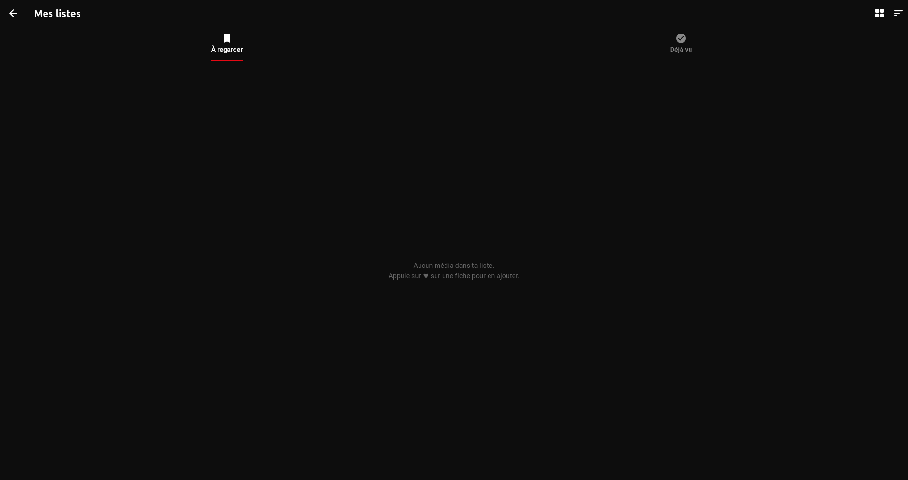

# JellyClient — Captures d'écran (Linux, référence visuelle)

Captures prises le 2026-05-15 sur la version Linux production.  
Résolution native : **1920 × 1016**. Dossier : `screenshots/`  
Utilisées comme référence visuelle pour le portage Windows et le développement futur.

---

## 01 — Accueil : Hero Banner

**Fichier** : `screenshots/01_accueil_hero.png`

### Ce qu'on voit
- **AppBar** : transparent au départ (transition vers opaque au scroll via `ValueNotifier`)
- **Hero Banner** : backdrop plein écran, logo du film en overlay SVG/texte, synopsis tronqué, badges genres/année
- **Boutons** : `▶ Lire` (blanc, prioritaire) + `ℹ Détails` (outline)
- **Sections** : Bibliothèques (cartes image 260×145), Top 10 avec numéros Netflix stylisés
- **Flèches ← →** : à droite du titre "Top 10" pour naviguer le rail

### Widgets clés
- `_HeroBannerContent` : `SizedBox(height: screenH × 0.50)` + `Stack`
- `_LibraryChip` : 260×145, image aléatoire, gradient bas, icône + nom
- `_Top10Section` : `ValueNotifier` + `_ScrollArrow`
- `_Top10Card` : grand numéro (police proportionnelle), poster décalé de 42px

---

## 02 — Accueil : Sections scrollées

**Fichier** : `screenshots/02_accueil_sections.png`

### Ce qu'on voit
- **Top 10** (fin du rail) : numéros 5-7 visibles avec films
- **Récents — Séries** : rail horizontal avec flèches ← →
- **Sections genre** : Action, Action & Adventure (4 genres max)
- Chaque section = `_HorizontalSection` avec `itemExtent` + `RepaintBoundary`

### Points importants
- Toutes les sections ont des flèches ← → dans leur en-tête
- La flèche gauche est grisée quand on est au début, blanche sinon
- `cacheExtent: 400` sur le `ListView` principal (précharge 400px hors écran)

---

## 03 — Bibliothèque : Grille avec contenu

**Fichier** : `screenshots/03_bibliotheque_grid.png`

### Ce qu'on voit
- **En-tête** : titre de la bibliothèque + tri (A-Z actif, badge rouge)
- **Chips de tri** : A–Z, Date, Note, Année
- **Chips type** : Tous, Films, Séries (sélectionné en rouge), Saisons
- **Chips genre** : Tous genres + genres dynamiques depuis Jellyfin
- **Grille** : cards 2/3 avec badge SÉRIE, badges NOUVEAU (bleu), barres de progression

### Hover sur une card
- Overlay sombre avec ▶ (bouton blanc circulaire), ♥ bookmark, ℹ info
- Synopsis tronqué en haut
- Note ★ + année + **temps restant** en rouge si en cours

---

## 03b — Bibliothèque : Interface de filtres

**Fichier** : `screenshots/03b_bibliotheque_filtres.png`

### Ce qu'on voit
- Tri + chips type + chips genre — tous les contrôles de filtrage
- Compteur `X / N médias` (top droit, rouge)
- État "Aucun contenu" quand les filtres ne matchent rien
- Chips genre scrollable horizontalement

---

## 04 — Fiche Film : Haut (backdrop + boutons)

**Fichier** : `screenshots/04_film_detail_haut.png`  
**Film** : "Arrête-moi si tu peux" — Spielberg, DiCaprio, Hanks

### Ce qu'on voit
- **SliverAppBar** : `expandedHeight: 220`, backdrop image plein écran, bouton ← retour pinned
- **Titre** (24px bold blanc) + badges : année, durée, classification officielle
- **Chips genre** cliquables → naviguent vers `/genre/X`
- **Bouton Lire / Reprendre** : blanc, pleine largeur, `ElevatedButton`, 14px vertical padding
- **Row actions** : ♥ `IconButton` Watchlist · ✓ Déjà vu · ❤ Favori Jellyfin · `IMDb` badge outline cliquable · Spacer · ↺ Refresh
- **Synopsis** complet : `TextStyle(fontSize: 17, height: 1.65, color: 0xFFCCCCCC)`
- **Section Casting** : `Divider` + titre "Casting & Équipe" + labels rôle (gris) + **noms en blanc** (cliquables → `/person/:id`)
- **ActorRow** : scroll horizontal, photos circulaires 88px, nom + rôle

---

## 04b — Fiche Film : Noms casting (zoom)

**Fichier** : `screenshots/04b_film_detail_cast_noms.png`

### Ce qu'on voit
- Noms des réalisateurs/scénaristes/producteurs en **blanc** (soulignement gris discret)
- Photos acteurs circulaires 88px avec nom + rôle en dessous
- Section "Dans le même genre" (More Like This) en bas

---

## 04c — Fiche Film : More Like This

**Fichier** : `screenshots/04c_film_detail_more.png`

### Ce qu'on voit
- Rail "Dans le même genre" : 10 films aléatoires, cards 133px de large
- Provider IDs : TMDb, TVDb en badges gris discrets en bas de page

---

## 04d — Play Sheet (modal audio/sous-titres)

**Fichier** : `screenshots/04d_film_play_sheet.png`

### Ce qu'on voit
- **Modal bottom sheet** : fond `Color(0xFF1A1A1A)`, `borderRadius: vertical(top: 16)`
- **Handle** : barre grise 40×4px centrée en haut
- **Titre** "Audio & Sous-titres" (16px bold)
- **Section "Piste audio"** : label gris 12px + `Wrap` de `ChoiceChip`
  - Chip sélectionné : fond rouge `#E50914` + texte blanc
  - Chip non sélectionné : fond `0xFF2A2A2A` + texte `0xFFCCCCCC`
  - Contenu chip : "DTS 2.0 - French - Stereo - Par défaut"
- **Section "Sous-titres"** (si dispo) : même layout + chip "Aucun"
- **Bouton "▶ Lire / Reprendre"** : blanc pleine largeur, même style que bouton principal

### Auto-sélection
La sheet lit `getPreferredAudioLang(userId)` et `getPreferredSubLang(userId)` au `initState` et sélectionne automatiquement la langue préférée de l'utilisateur.

---

## 05 — Fiche Film : Casting complet (ancienne capture)

**Fichier** : `screenshots/05_film_detail_casting.png`

---

## 06 — Fiche Série : Header complet

**Fichier** : `screenshots/06_serie_header.png`  
**Série** : "30 Rock" — 7 saisons, comédie NBC

### Ce qu'on voit
- **Backdrop** 220px + gradient `0x440D0D0D → 0xFF0D0D0D` + bouton ← retour `Positioned(top: padding+4, left: 0)`
- **Titre** 24px bold + badges : badges année, nombre de saisons, note ★, épisodes non vus (rouge)
- **Bouton prochain épisode** (blanc, pleine largeur) : `▶ SxxExx — Titre de l'épisode`
  - Via `getNextUp(userId, seriesId)` — `GET /Shows/NextUp`
  - Lance VLC avec `onStopped` → rapport progression
- **Row actions** : ♥ Watchlist · ✓ Vu · ❤ Favori Jellyfin · IMDb · Spacer · ↺ Refresh
- **Synopsis** : 4 lignes max, tronqué (`overflow: ellipsis`)
- **CastSection** : photos circulaires scroll horizontal
- **TabBar** sticky `SliverPersistentHeader(pinned: true)` : onglets saisons
- **Boutons saison** : "Lire Saison X (N ép.)" + "Choisir" (outline)

---

## 06b — Fiche Série : Liste épisodes

**Fichier** : `screenshots/06b_serie_episodes.png`

### Ce qu'on voit
- **Row épisode** (`_EpisodeCard`) :
  - Thumbnail 160×90px (`ClipRRect(borderRadius: 6)`) + barre progression rouge au bas
  - Icône ▶ centré sur thumbnail (Container 36×36, fond noir 45%)
  - Badge vu ✓ (top-right thumbnail)
  - Infos droite : "Épisode N" (gris 11px) + titre (blanc 14px bold) + durée (gris 12px) + synopsis 2 lignes
  - `_MarkPlayedButton` à l'extrême droite (✓ toggle)
- **Clic sur la row** → `_EpisodePlaySheet` (modal audio/sous-titres)

### _EpisodePlaySheet (modal épisode)
- Titre épisode (16px bold) + "Épisode N" (gris 12px)
- Chips pistes audio (auto-sélection langue préférée)
- Chips sous-titres
- Bouton blanc "▶ Lire / Reprendre"
- **Bouton outline "⏩ Passer l'intro (→ X:XX)"** si plugin IntroSkipper actif
- Bouton vert "Marquer comme vu / non vu"

---

## 07 — Fiche Série : Épisodes scroll (ancienne capture)

**Fichier** : `screenshots/07_serie_episodes.png`

---

## 08 — Recherche : Vide

**Fichier** : `screenshots/08_recherche_vide.png`

### Ce qu'on voit
- Barre de recherche rouge pleine largeur, focus automatique
- Placeholder : "Titre, acteur, réalisateur..."
- Message "Entrez 2 caractères minimum" au centre
- Bouton ← retour en haut gauche

---

## 09 — Recherche : Résultats

**Fichier** : `screenshots/09_recherche_resultats.png`

### Ce qu'on voit
- Texte "naruto" dans la barre (debounce 400ms avant requête)
- Section **Médias** : cards 2/3 avec badge SÉRIE, titres
- (Quand des acteurs matchent : section **Personnes** avec photos rondes)
- Clic sur un résultat → `navigateToItem()` → fiche film ou série

---

## 10 — Paramètres

**Fichier** : `screenshots/10_parametres.png`

### Ce qu'on voit
- **Préférences de lecture** : chips langue audio (English sélectionné), chips sous-titres (Français sélectionné)
- **Bouton "Enregistrer les préférences"** rouge pleine largeur — obligatoire pour sauvegarder
- **Lecteur externe** : chips VLC/mpv/celluloid/totem + champ texte chemin
- Exemples sous le champ : `vlc · mpv · /usr/bin/vlc · /snap/bin/vlc`
- **Bouton "Enregistrer"** pour le lecteur
- **Application** : bouton "Redémarrer JellyClient"

### Points importants pour le portage Windows
- Les chips du lecteur incluent "vlc" qui auto-détecte Program Files
- Le champ texte accepte un chemin absolu Windows : `C:\Program Files\VideoLAN\VLC\vlc.exe`
- "Redémarrer" utilise `Platform.resolvedExecutable + exit(0)` — fonctionne sur Windows

---

## 11 — Sélection de profil

**Fichier** : `screenshots/11_profils.png`

### Ce qu'on voit
- Titre **JellyClient** centré + "Qui regarde ?" + nom du serveur
- Grille d'avatars : photo de profil Jellyfin (ou initiale sur fond coloré si pas de photo)
- Lien **"Gérer les comptes"** + **"+ Ajouter un compte"** en bas
- Clic sur un profil → `setActiveServer()` → navigue vers `/home`

---

## 12 — Mes listes (Watchlist)

**Fichier** : `screenshots/12_mes_listes.png`

### Ce qu'on voit
- **Onglet "À regarder"** (♥) + **"Déjà vu"** (✓) — TabBar
- Icônes grille/liste (top droit) pour changer la vue
- État vide : "Aucun média dans ta liste. Appuie sur ♥ sur une fiche pour en ajouter."
- Quand rempli : grille de cards + swipe-to-dismiss pour supprimer

---

## Résumé des routes et écrans

| Route | Écran | Screenshot |
|---|---|---|
| `/home` | Accueil (Hero + sections) | 01, 02 |
| `/library/:id` | Grille bibliothèque | 03, 03b |
| `/detail/:id` | Fiche Film | 04, 05 |
| `/series/:id` | Fiche Série + épisodes | 06, 07 |
| `/search` | Recherche | 08, 09 |
| `/settings` | Paramètres | 10 |
| `/profiles` | Sélection profil | 11 |
| `/watchlist` | Mes listes | 12 |
| `/genre/:name` | Grille par genre | (idem bibliothèque) |
| `/person/:id` | Fiche acteur + filmo | (idem bibliothèque) |
| `/servers` | Gestion serveurs | — |
